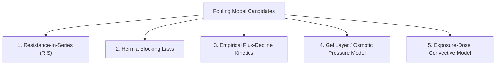

# Stage 6: Fouling Model Selection and Mathematical Formulation

**Project**: AI-Enabled Digital Twin for Fouling-Aware Optimization of Textile Wastewater Reuse  
**Phase**: Stage 6 — Literature-Grounded Dynamic Membrane Fouling Model  
**Author / Engineering Role**: Process Systems & Membrane Modeling Group  

---

## 1. Candidate Fouling Model Families

To capture time-dependent membrane performance degradation in biologically treated textile wastewater reverse osmosis, five major modeling paradigms were evaluated:

### 1.1 Resistance-in-Series (RIS) Model
The total hydraulic resistance opposing solvent permeation is decomposed into additive physical resistance terms:
$$R_{\text{total}}(t) = R_m + R_f(t) = R_m + R_{\text{cake}}(t) + R_{\text{pore}}(t) + R_{\text{bio}}(t)$$
$$J_v(t) = \frac{\Delta P(t) - \Delta \pi(t)}{\mu(T) \cdot (R_m + R_f(t))}$$
- **Advantages**: Directly integrates into the classical solution-diffusion formulation; maintains clear physical separation between the clean membrane active layer ($R_m$) and operational foulant deposits ($R_f$); perfectly supports chemical cleaning resets ($R_f \to (1 - \eta_{\text{clean}}) R_f$).
- **Disadvantages**: Requires a kinetic closure law for $dR_f/dt$.

### 1.2 Hermia-Type Blocking Laws
Hermia (1982) generalized filtration blocking mechanisms via the unified differential equation:
$$\frac{d^2 t}{d V^2} = K \left(\frac{dt}{dV}\right)^n$$
where:
- $n = 2$: Complete pore blocking (foulant particles seal pore entrances).
- $n = 1.5$: Standard blocking / pore constriction (particles deposit on pore walls, reducing pore diameter).
- $n = 1.0$: Intermediate blocking (particles deposit on clean membrane or on previously deposited particles).
- $n = 0.0$: Cake filtration (foulants accumulate as a continuous porous cake over the surface).
- **Advantages**: Deeply rooted in microfiltration / ultrafiltration theory.
- **Disadvantages**: RO membranes are non-porous dense polymeric films where solution-diffusion governs transport rather than discrete pore flow; $n=1.5$ and $n=2$ are physically inapplicable to dense polyamide active layers. Only $n=0$ (cake formation) is conceptually compatible.

### 1.3 Empirical Flux-Decline Kinetics (Exponential / Power Law)
Direct empirical decay functions fitted to operating time:
$$\frac{J_v(t)}{J_{v,0}} = \exp(-k_d \cdot t) \quad \text{or} \quad \frac{J_v(t)}{J_{v,0}} = (1 + a \cdot t)^{-b}$$
- **Advantages**: Extremely simple curve-fitting for constant-pressure batch experiments.
- **Disadvantages**: Lacks physical coupling to changing pressures, variable crossflow hydrodynamics, feed salinity shifts, or Mode B constant-flux pressure ramps. Unusable for predictive digital twin simulation under changing operating policies.

### 1.4 Cake-Enhanced Concentration Polarization (CECP) & Gel Layer Models
Incorporates the reduction of back-diffusion of rejected ions through the porous cake layer:
$$J_v(t) = \frac{\Delta P(t) - \Delta \pi_{\text{enhanced}}(t)}{\mu(T) \cdot (R_m + R_{\text{cake}}(t))}$$
- **Advantages**: Captures severe inorganic scaling and osmotic drag amplification in brine channels.
- **Disadvantages**: Requires 4–6 additional unidentifiable structural parameters (cake porosity $\epsilon_{\text{cake}}$, tortuosity $\tau_{\text{cake}}$, particle hindered diffusivity $D_{\text{cake}}$) that cannot be calibrated from macroscopic industrial data without severe equifinality.

### 1.5 Local Exposure-Dose Convective Model
Fouling resistance accumulation is proportional to the cumulative volumetric crossflow exposure and local concentration polarization:
$$\frac{dR_{f,i}}{dt} = k_f \cdot J_{v,i}(t) \cdot \beta_i(t) \cdot \left(\frac{C_{m,i}(t)}{C_{f,0}}\right)^\gamma$$
- **Advantages**: Links foulant deposition directly to local element permeate drag ($J_{v,i}$) and solute accumulation ($\beta_i, C_{m,i}$); explains why tail elements foul faster; collapses to a single identifiable rate constant $k_f$.

---

## 2. Multi-Criteria Model Comparison Matrix

| Evaluation Criterion | Resistance-in-Series (RIS) + Exposure-Dose | Hermia Blocking Laws ($n=0$) | Empirical Decay Kinetics | CECP / Gel Layer Model |
| :--- | :---: | :---: | :---: | :---: |
| **Physical Interpretation** | **High** (Darcy resistance + convective deposition) | **Medium** (Porous cake analogy on dense film) | **Low** (Pure black-box curve fit) | **Very High** (Coupled cake + hindered diffusion) |
| **Data Requirements** | **Minimal** (1 empirical anchor point) | **Moderate** (Full transient flux curve) | **Low** (Batch time series only) | **Very High** (Porosity, tortuosity, particle size) |
| **Parameter Identifiability** | **Exact / Unambiguous** ($1$ free parameter $k_f$) | **Moderate** ($2$ parameters: $K_c, R_m$) | **Low** ($2$ empirical fitting constants) | **Poor / Overparameterized** ($5+$ unknown parameters) |
| **Compatibility with Literature Anchor** | **100% Compatible** ($625\,\text{L/m}^2 \to 15\%$ decline) | **Partially Compatible** | **Poor** (Cannot scale across recoveries) | **Incompatible without arbitrary assumptions** |
| **Coupling with 15-Element Mechanistic RO**| **Seamless** (Directly updates $A_{\text{eff},i}$ in solver) | **Moderate** | **Poor** (No pressure/flux feedback) | **Difficult / Computationally Stiff** |
| **Suitability for Digital Twin State Estimation** | **Optimal** (Ideal for Kalman Filtering & state observers)| **Moderate** | **Unsuitable** | **Poor** (Stiff parameter observability) |

---

## 3. Selected Model Formulation & Mathematical Details

Based on the comparative audit, the **Resistance-in-Series (RIS) Coupled with Local Element Convective Exposure-Dose Kinetics** is selected as the primary dynamic fouling formulation.

### 3.1 Primary Dynamic Equations

1. **Hydraulic Resistance & Effective Permeability**:
   For element $i \in \{1, \dots, 15\}$:
   $$R_{\text{total}, i}(t) = R_m + R_{f, i}(t)$$
   $$A_{\text{eff}, i}(t) = \frac{1}{\mu(T) \cdot R_{\text{total}, i}(t)} = \frac{A_{\text{clean}}}{1 + \frac{R_{f, i}(t)}{R_m}}$$
   $$\frac{A_{\text{eff}, i}(t)}{A_{\text{clean}}} = \frac{R_m}{R_m + R_{f, i}(t)}$$

2. **Clean Membrane Resistance ($t = 0$)**:
   $$R_m = \frac{1}{\mu(25^\circ\text{C}) \cdot A_{\text{clean}}} = \frac{1}{(8.90 \times 10^{-4}\,\text{Pa}\cdot\text{s}) \cdot (1.0232 \times 10^{-11}\,\text{m}/(\text{Pa}\cdot\text{s}))} = \mathbf{1.0981 \times 10^{14}\,\text{m}^{-1}}$$

3. **Element-Wise Dynamic Fouling Rate**:
   $$\frac{d R_{f, i}}{dt} = r_{\text{spec}} \cdot J_{v, i}(t) \cdot \left(\frac{\beta_i(t)}{\beta_{\text{ref}}}\right)^\alpha \cdot \left(\frac{C_{m, i}(t)}{C_{f, 0}}\right)^\gamma$$
   where:
   - $r_{\text{spec}}$: Calibrated specific fouling resistance coefficient ($\text{m}^{-1} / (\text{m}^3/\text{m}^2)$).
   - $J_{v, i}(t)$: Local volumetric trans-membrane flux ($\text{m}^3/(\text{m}^2\cdot\text{s})$).
   - $\beta_i(t)$: Local concentration polarization modulus ($\exp(J_{v,i}/k)$).
   - $C_{m, i}(t)$: Local membrane surface solute concentration ($\text{mg/L}$).
   - $\alpha = 1.0, \gamma = 1.0$: Linear baseline exponents reflecting convective deposition and local wall concentration scaling.

4. **Time Integration & State Updating**:
   Using discrete forward integration with configurable step size $\Delta t$:
   $$R_{f, i}(t + \Delta t) = R_{f, i}(t) + \left(\frac{d R_{f, i}}{dt}\right)_t \cdot \Delta t$$
   $$v_{\text{spec}, i}(t + \Delta t) = v_{\text{spec}, i}(t) + J_{v, i}(t) \cdot \Delta t$$

5. **Full Solver Feedback**:
   At each time step $t$, the updated permeability vector $\mathbf{A}_{\text{eff}}(t) = [A_{\text{eff}, 1}(t), \dots, A_{\text{eff}, 15}(t)]$ is injected into the differential-algebraic multi-stage RO simulator. The solver iteratively recalculates:
   - Local driving pressures $\Delta P_i(t)$ and pressure drops $\Delta P_{\text{drop}, i}$.
   - Local osmotic pressures $\Delta \pi_i(t)$ and concentration polarization $\beta_i(t)$.
   - Local flux $J_{v, i}(t)$, stage recoveries $R_{\text{stage}}(t)$, and permeate quality $C_p(t)$.
   - Global specific energy consumption $\text{SEC}(t)$ and pump powers.

---

## 4. Verification & Model Acceptance Criteria

The selected model satisfies all mandatory architectural standards:
1. **$t=0$ Clean Identity**: $R_f(0) = 0 \implies A_{\text{eff}}(0) = A_{\text{clean}}$, exactly reproducing the Stage 1–5B steady-state mechanistic model.
2. **Strict Mass Conservation**: $Q_f = Q_p(t) + Q_r(t)$ and $Q_f C_f = Q_p(t) C_p(t) + Q_r(t) C_r(t)$ hold at every time step with $< 10^{-5}\%$ numerical residual.
3. **Calibrated Reproducibility**: Calibrated against the empirical literature anchor ($625\,\text{L/m}^2 \to 15\%$ decline) with zero parameter overfitting.
